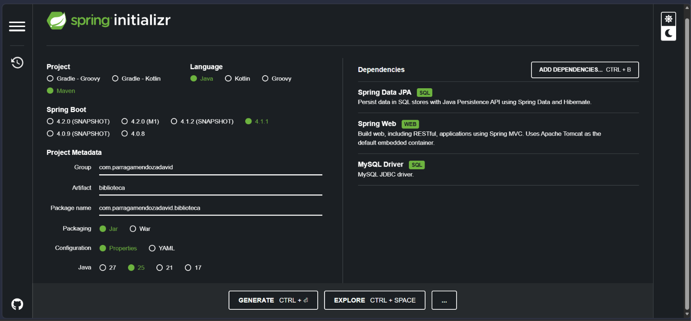
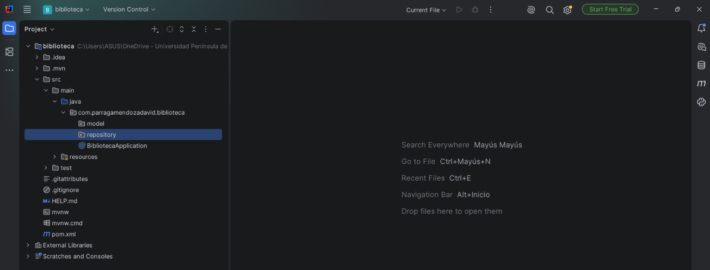
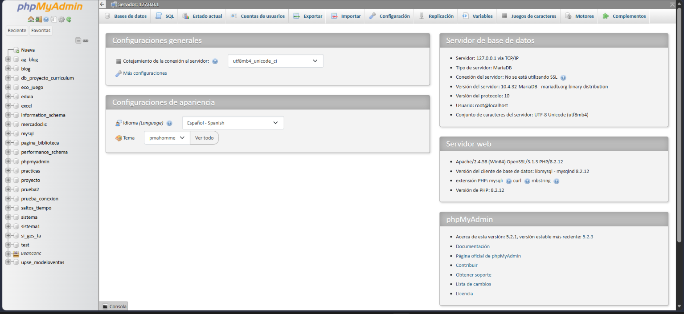
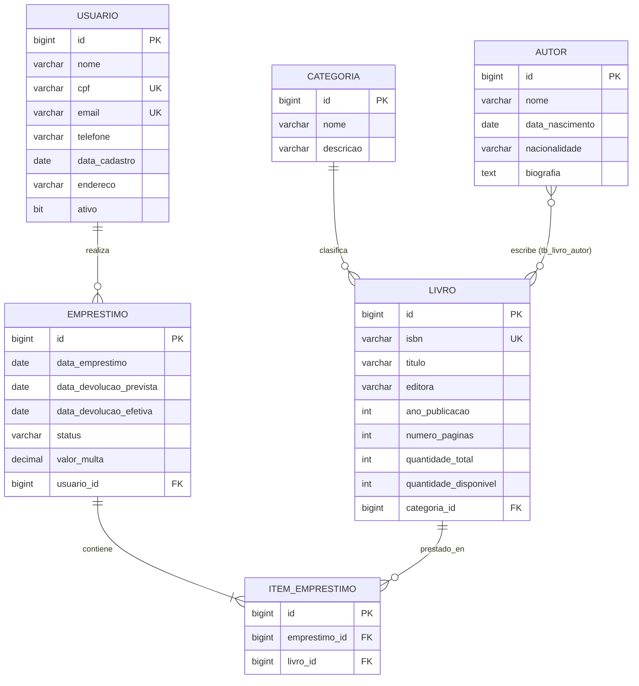
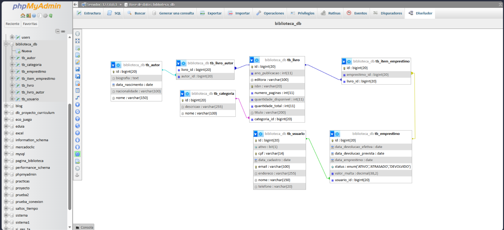

<div align="center">

# 📚 Sistema de Biblioteca — Spring Data JPA
### Desarrollo de Sistemas Corporativos (DSC)


---

[](https://www.oracle.com/java/)
[](https://spring.io/projects/spring-boot)
[](https://spring.io/projects/spring-data-jpa)
[](https://www.mysql.com/)
[](https://hibernate.org/)
[](https://maven.apache.org/)

</div>

---

## 🛠️ Stack & Herramientas


| Categoría | Tecnología / Herramienta | Versión / Detalle |
| :--- | :--- | :--- |
| **Lenguaje** | [Java](https://www.oracle.com/java/) | JDK 25 |
| **Framework Base** | [Spring Boot](https://spring.io/projects/spring-boot) | 4.1.1 |
| **Capa de Persistencia** | [Spring Data JPA](https://spring.io/projects/spring-data-jpa) & [Hibernate](https://hibernate.org/) | ORM y Repositorios |
| **Base de Datos** | [MySQL](https://www.mysql.com/) / MariaDB (vía [XAMPP](https://www.apachefriends.org/)) | `biblioteca_db` |
| **IDE Principal** | [IntelliJ IDEA](https://www.jetbrains.com/idea/) | Entorno de desarrollo |
| **Gestor de Construcción** | [Apache Maven](https://maven.apache.org/) | Automatización de dependencias |
| **Control de Versiones** | [Git](https://git-scm.com/) | Versionamiento de código |

---

## 📑 Tabla de Contenidos

1. [Inicialización e Infraestructura del Proyecto](#1-inicialización-e-infraestructura-del-proyecto)
   - [1.1. Generar la estructura base con Spring Initializr](#11-generar-la-estructura-base-con-spring-initializr)
   - [1.2. Seleccionar las dependencias necesarias](#12-seleccionar-las-dependencias-necesarias)
   - [1.3. Organizar la estructura de paquetes en el IDE](#13-organizar-la-estructura-de-paquetes-en-el-ide)
2. [Configuración de MySQL con XAMPP](#2-configuración-de-mysql-con-xampp)
3. [Configuración de application.properties](#3-configuración-de-applicationproperties)
4. [Diseño y Creación de las Entidades](#4-creación-de-las-entidades)
   - [4.1. Mapeo Objeto-Relacional y Clases Entity](#41-cuántas-clases-entity-se-crearán-en-el-paquete-model)
   - [4.2. Entidades Independientes (`Categoria`, `Usuario`, `Autor`)](#42-entidades-independientes)
   - [4.3. Entidades con Relaciones (`Livro`)](#43-entidades-con-relaciones)
   - [4.4. Estado y Entidad del Préstamo (`Emprestimo`, `StatusEmprestimo`)](#44-estado-y-entidad-del-préstamo)
   - [4.5. Entidad Asociativa (`ItemEmprestimo`)](#45-entidad-asociativa-itememprestimo)
   - [4.6. Diagrama Relacional en phpMyAdmin](#46-diagrama-del-modelo-relacional-en-phpmyadmin)
5. [Creación de la Capa de Repositorios (repository)](#5-creación-de-la-capa-de-repositorios-repository)
   - [5.1. CategoriaRepository](#51-categoriarepositoryjava)
   - [5.2. AutorRepository](#52-autorrepositoryjava)
   - [5.3. UsuarioRepository](#53-usuariorepositoryjava)
   - [5.4. LivroRepository](#54-livrorepositoryjava)
   - [5.5. EmprestimoRepository](#55-emprestimorepositoryjava)
   - [5.6. ItemEmprestimoRepository](#56-itememprestimorepositoryjava)
6. [Prueba y Carga de Datos con DataLoader.java](#6-prueba-y-carga-de-datos-con-dataloaderjava)
7. [Ejecución y Resultados Esperados](#7-ejecución-y-resultados-esperados)
8. [🔗 Enlaces y Recursos Útiles](#8-enlaces-y-recursos-útiles)

---

> [!NOTE]
> **Propósito de esta guía:** Proveer un recorrido detallado paso a paso para configurar la infraestructura, modelar las entidades de dominio, implementar repositorios JPA con consultas derivadas y JPQL, y validar el funcionamiento del sistema en MySQL mediante pruebas automatizadas con `CommandLineRunner`.

---

## 1. Inicialización e infraestructura del proyecto

### 1.1. Generar la estructura base con Spring Initializr

Para iniciar el proyecto, accede a la herramienta oficial:

> 🌐 **Herramienta Web:** [](https://start.spring.io/)

Configura los parámetros del proyecto tal como se indica a continuación:

- **Project:** Maven Project
- **Language:** Java
- **Spring Boot:** `4.1.1` (o versión estable reciente)
- **Group:** `com.parragamendozadavid`
- **Artifact:** `biblioteca`
- **Packaging:** Jar
- **Java Version:** `25`

### 1.2. Seleccionar las dependencias necesarias

Agrega las siguientes dependencias clave en el panel de configuración:

- 🗄️ **Spring Data JPA** (`spring-boot-starter-data-jpa`): Proporciona abstracción de repositorios, integración con Hibernate y soporte ORM completo.
- 🌐 **Spring Web** (`spring-boot-starter-web`): Requerido para construir APIs REST y controladores web.
- 🐬 **MySQL Driver** (`mysql-connector-j`): Conector JDBC para interactuar de forma nativa con MySQL / MariaDB.

<p align="center">
  
  <br>
  <em><b>Figura 1:</b> Selección de dependencias y metadata del proyecto en Spring Initializr.</em>
</p>

---

### 1.3. Organizar la estructura de paquetes en el IDE

Una vez descargado e importado el proyecto en tu IDE ([IntelliJ IDEA](https://www.jetbrains.com/idea/)), asegúrate de crear los subpaquetes estrictamente dentro del paquete raíz (`com.parragamendozadavid.biblioteca`) para garantizar el escaneo automático de componentes (`@ComponentScan`):

- 📦 `com.parragamendozadavid.biblioteca.model`: Contiene las clases `@Entity` mapeadas a las tablas relacionales.
- 📦 `com.parragamendozadavid.biblioteca.repository`: Contiene las interfaces que extienden de `JpaRepository`.

<p align="center">
  
  <br>
  <em><b>Figura 2:</b> Jerarquía de paquetes y archivos fuente en IntelliJ IDEA.</em>
</p>

---

## 2. Configuración de MySQL con XAMPP

Para levantar la base de datos local:

1. Abre el panel de control de **XAMPP** (`XAMPP Control Panel`).
2. Inicia el servicio de **MySQL** haciendo clic en **Start**.
3. Inicia opcionalmente el servicio de **Apache** para acceder a la interfaz de administración web.
4. Ingresa a la interfaz web de administración a través del enlace:
   
   > 🌐 **Panel Web Local:** [](http://localhost/phpmyadmin)

<p align="center">
  
  <br>
  <em><b>Figura 3:</b> Panel de administración de phpMyAdmin ejecutándose en localhost.</em>
</p>

---

## 3. Configuración de `application.properties`

Ubica el archivo `src/main/resources/application.properties` y define los parámetros de conexión JDBC e Hibernate:

```properties
spring.application.name=biblioteca

# ======================================================
# Configuración de conexión a MySQL (XAMPP)
# ======================================================
spring.datasource.url=jdbc:mysql://localhost:3306/biblioteca_db?createDatabaseIfNotExist=true&serverTimezone=UTC
spring.datasource.username=root
spring.datasource.password=
spring.datasource.driver-class-name=com.mysql.cj.jdbc.Driver

# ======================================================
# Configuración de JPA / Hibernate
# ======================================================
spring.jpa.hibernate.ddl-auto=update
spring.jpa.show-sql=true
spring.jpa.properties.hibernate.format_sql=true
```

> [!TIP]
> **Creación automática de la base de datos:** El parámetro `createDatabaseIfNotExist=true` en la URL de conexión asegura que la base de datos `biblioteca_db` sea creada automáticamente en MySQL al iniciar la aplicación por primera vez, sin necesidad de ejecutar scripts SQL manuales.

---

## 4. Creación de las entidades

Tomando como base la especificación del esquema relacional:

> [!NOTE]
> 📄 **Documento de especificación:** `Modelo Lógico - Sistema de Biblioteca.pdf` define **7 tablas relacionales** en la base de datos:
> 
> 1. `LIVRO`
> 2. `AUTOR`
> 3. `CATEGORIA`
> 4. `USUARIO`
> 5. `EMPRESTIMO`
> 6. `ITEM_EMPRESTIMO`
> 7. `LIVRO_AUTOR` (tabla asociativa de relación N:N)

### Diagrama Entidad-Relación



---

### 4.1. ¿Cuántas clases `@Entity` se crearán en el paquete `model`?

En la práctica con **Spring Data JPA**, se implementan **6 clases Java**:

- **5 entidades de negocio principales:** `Categoria`, `Usuario`, `Autor`, `Livro` y `Emprestimo`.
- **1 entidad asociativa explícita (`ItemEmprestimo`):** Mapea la relación intermedia entre un préstamo y un libro.
- **`LIVRO_AUTOR`:** **No requiere su propia clase Java**. Dado que es una relación N:N pura sin atributos adicionales (solo claves foráneas), JPA la genera automáticamente en la base de datos mediante `@ManyToMany` con `@JoinTable(name = "tb_livro_autor")`.

---

### 4.2. Entidades independientes

#### 4.2.1. `Categoria.java`

Mapea la tabla `tb_categoria`.

```java
package com.parragamendozadavid.biblioteca.model;

import jakarta.persistence.*;

@Entity
@Table(name = "tb_categoria")
public class Categoria {

    @Id
    @GeneratedValue(strategy = GenerationType.IDENTITY)
    private Long id;

    @Column(nullable = false, length = 100)
    private String nome;

    @Column(length = 255)
    private String descricao;

    public Categoria() {
    }

    public Categoria(String nome, String descricao) {
        this.nome = nome;
        this.descricao = descricao;
    }

    public Long getId() {
        return id;
    }

    public void setId(Long id) {
        this.id = id;
    }

    public String getNome() {
        return nome;
    }

    public void setNome(String nome) {
        this.nome = nome;
    }

    public String getDescricao() {
        return descricao;
    }

    public void setDescricao(String descricao) {
        this.descricao = descricao;
    }
}
```

---

#### 4.2.2. `Usuario.java`

Mapea la tabla `tb_usuario`, con restricciones únicas en `cpf` y `email`.

```java
package com.parragamendozadavid.biblioteca.model;

import jakarta.persistence.*;
import java.time.LocalDate;

@Entity
@Table(name = "tb_usuario")
public class Usuario {

    @Id
    @GeneratedValue(strategy = GenerationType.IDENTITY)
    private Long id;

    @Column(nullable = false, length = 150)
    private String nome;

    @Column(nullable = false, unique = true, length = 14)
    private String cpf;

    @Column(nullable = false, unique = true, length = 100)
    private String email;

    @Column(length = 20)
    private String telefone;

    @Column(name = "data_cadastro", nullable = false)
    private LocalDate dataCadastro = LocalDate.now();

    @Column(length = 255)
    private String endereco;

    @Column(nullable = false)
    private Boolean ativo = true;

    public Usuario() {
    }

    public Usuario(String nome, String cpf, String email, String telefone, String endereco) {
        this.nome = nome;
        this.cpf = cpf;
        this.email = email;
        this.telefone = telefone;
        this.dataCadastro = LocalDate.now();
        this.endereco = endereco;
        this.ativo = true;
    }

    // Getters y Setters
    public Long getId() {
        return id;
    }

    public void setId(Long id) {
        this.id = id;
    }

    public String getNome() {
        return nome;
    }

    public void setNome(String nome) {
        this.nome = nome;
    }

    public String getCpf() {
        return cpf;
    }

    public void setCpf(String cpf) {
        this.cpf = cpf;
    }

    public String getEmail() {
        return email;
    }

    public void setEmail(String email) {
        this.email = email;
    }

    public String getTelefone() {
        return telefone;
    }

    public void setTelefone(String telefone) {
        this.telefone = telefone;
    }

    public LocalDate getDataCadastro() {
        return dataCadastro;
    }

    public void setDataCadastro(LocalDate dataCadastro) {
        this.dataCadastro = dataCadastro;
    }

    public String getEndereco() {
        return endereco;
    }

    public void setEndereco(String endereco) {
        this.endereco = endereco;
    }

    public Boolean getAtivo() {
        return ativo;
    }

    public void setAtivo(Boolean ativo) {
        this.ativo = ativo;
    }
}
```

---

#### 4.2.3. `Autor.java`

Mapea la tabla `tb_autor`.

```java
package com.parragamendozadavid.biblioteca.model;

import jakarta.persistence.*;
import java.time.LocalDate;

@Entity
@Table(name = "tb_autor")
public class Autor {

    @Id
    @GeneratedValue(strategy = GenerationType.IDENTITY)
    private Long id;

    @Column(nullable = false, length = 150)
    private String nome;

    @Column(name = "data_nascimento")
    private LocalDate dataNascimento;

    @Column(length = 100)
    private String nacionalidade;

    @Column(columnDefinition = "TEXT")
    private String biografia;

    public Autor() {
    }

    public Autor(String nome, LocalDate dataNascimento, String nacionalidade, String biografia) {
        this.nome = nome;
        this.dataNascimento = dataNascimento;
        this.nacionalidade = nacionalidade;
        this.biografia = biografia;
    }

    // Getters y Setters
    public Long getId() {
        return id;
    }

    public void setId(Long id) {
        this.id = id;
    }

    public String getNome() {
        return nome;
    }

    public void setNome(String nome) {
        this.nome = nome;
    }

    public LocalDate getDataNascimento() {
        return dataNascimento;
    }

    public void setDataNascimento(LocalDate dataNascimento) {
        this.dataNascimento = dataNascimento;
    }

    public String getNacionalidade() {
        return nacionalidade;
    }

    public void setNacionalidade(String nacionalidade) {
        this.nacionalidade = nacionalidade;
    }

    public String getBiografia() {
        return biografia;
    }

    public void setBiografia(String biografia) {
        this.biografia = biografia;
    }
}
```

---

### 4.3. Entidades con relaciones

En esta clase mapeamos dos tipos de relaciones clave:

1. **`@ManyToOne` con `Categoria`:** Múltiples libros pertenecen a una misma categoría. Se configura `fetch = FetchType.LAZY` para optimizar rendimiento evitando consultas innecesarias.
2. **`@ManyToMany` con `Autor`:** Un libro puede tener varios autores y un autor puede haber escrito varios libros. Se configura la tabla intermedia asociativa `tb_livro_autor` usando `@JoinTable`.

#### 4.3.1. `Livro.java`

```java
package com.parragamendozadavid.biblioteca.model;

import jakarta.persistence.*;
import java.util.ArrayList;
import java.util.List;

@Entity
@Table(name = "tb_livro")
public class Livro {

    @Id
    @GeneratedValue(strategy = GenerationType.IDENTITY)
    private Long id;

    @Column(nullable = false, unique = true, length = 20)
    private String isbn;

    @Column(nullable = false, length = 200)
    private String titulo;

    @Column(length = 100)
    private String editora;

    @Column(name = "ano_publicacao")
    private Integer anoPublicacao;

    @Column(name = "numero_paginas")
    private Integer numeroPaginas;

    @Column(name = "quantidade_total", nullable = false)
    private Integer quantidadeTotal;

    @Column(name = "quantidade_disponivel", nullable = false)
    private Integer quantidadeDisponivel;

    // Relación N:1 con Categoria (Muchos libros -> Una categoría)
    @ManyToOne(fetch = FetchType.LAZY)
    @JoinColumn(name = "categoria_id", nullable = false)
    private Categoria categoria;

    // Relación N:N con Autor (Tabla asociativa intermedia)
    @ManyToMany
    @JoinTable(
            name = "tb_livro_autor",
            joinColumns = @JoinColumn(name = "livro_id"),
            inverseJoinColumns = @JoinColumn(name = "autor_id")
    )
    private List<Autor> autores = new ArrayList<>();

    public Livro() {
    }

    public Livro(String isbn, String titulo, String editora, Integer anoPublicacao, Integer numeroPaginas, Integer quantidadeTotal, Integer quantidadeDisponivel, Categoria categoria) {
        this.isbn = isbn;
        this.titulo = titulo;
        this.editora = editora;
        this.anoPublicacao = anoPublicacao;
        this.numeroPaginas = numeroPaginas;
        this.quantidadeTotal = quantidadeTotal;
        this.quantidadeDisponivel = quantidadeDisponivel;
        this.categoria = categoria;
    }

    // Getters y Setters
    public Long getId() {
        return id;
    }

    public void setId(Long id) {
        this.id = id;
    }

    public String getIsbn() {
        return isbn;
    }

    public void setIsbn(String isbn) {
        this.isbn = isbn;
    }

    public String getTitulo() {
        return titulo;
    }

    public void setTitulo(String titulo) {
        this.titulo = titulo;
    }

    public String getEditora() {
        return editora;
    }

    public void setEditora(String editora) {
        this.editora = editora;
    }

    public Integer getAnoPublicacao() {
        return anoPublicacao;
    }

    public void setAnoPublicacao(Integer anoPublicacao) {
        this.anoPublicacao = anoPublicacao;
    }

    public Integer getNumeroPaginas() {
        return numeroPaginas;
    }

    public void setNumeroPaginas(Integer numeroPaginas) {
        this.numeroPaginas = numeroPaginas;
    }

    public Integer getQuantidadeTotal() {
        return quantidadeTotal;
    }

    public void setQuantidadeTotal(Integer quantidadeTotal) {
        this.quantidadeTotal = quantidadeTotal;
    }

    public Integer getQuantidadeDisponivel() {
        return quantidadeDisponivel;
    }

    public void setQuantidadeDisponivel(Integer quantidadeDisponivel) {
        this.quantidadeDisponivel = quantidadeDisponivel;
    }

    public Categoria getCategoria() {
        return categoria;
    }

    public void setCategoria(Categoria categoria) {
        this.categoria = categoria;
    }

    public List<Autor> getAutores() {
        return autores;
    }

    public void setAutores(List<Autor> autores) {
        this.autores = autores;
    }
}
```

---

### 4.4. Estado y entidad del préstamo

#### 4.4.1. Enum `StatusEmprestimo.java`

Define los estados posibles de un préstamo bibliotecario:

```java
package com.parragamendozadavid.biblioteca.model;

public enum StatusEmprestimo {
    ATIVO,
    DEVOLVIDO,
    ATRASADO
}
```

---

#### 4.4.2. Entidad `Emprestimo.java`

Mapea la tabla `tb_emprestimo`. Representa el préstamo solicitado por un usuario, incluyendo fechas, estado y posibles multas aplicables:

```java
package com.parragamendozadavid.biblioteca.model;

import jakarta.persistence.*;
import java.math.BigDecimal;
import java.time.LocalDate;

@Entity
@Table(name = "tb_emprestimo")
public class Emprestimo {

    @Id
    @GeneratedValue(strategy = GenerationType.IDENTITY)
    private Long id;

    @Column(name = "data_emprestimo", nullable = false)
    private LocalDate dataEmprestimo = LocalDate.now();

    @Column(name = "data_devolucao_prevista", nullable = false)
    private LocalDate dataDevolucaoPrevista;

    @Column(name = "data_devolucao_efetiva")
    private LocalDate dataDevolucaoEfetiva;

    @Enumerated(EnumType.STRING)
    @Column(nullable = false, length = 20)
    private StatusEmprestimo status = StatusEmprestimo.ATIVO;

    @Column(name = "valor_multa")
    private BigDecimal valorMulta = BigDecimal.ZERO;

    // Relación N:1 con Usuario (Muchos préstamos pertenecen a un usuario)
    @ManyToOne(fetch = FetchType.LAZY)
    @JoinColumn(name = "usuario_id", nullable = false)
    private Usuario usuario;

    public Emprestimo() {
    }

    public Emprestimo(LocalDate dataDevolucaoPrevista, Usuario usuario) {
        this.dataEmprestimo = LocalDate.now();
        this.dataDevolucaoPrevista = dataDevolucaoPrevista;
        this.usuario = usuario;
        this.status = StatusEmprestimo.ATIVO;
        this.valorMulta = BigDecimal.ZERO;
    }

    // Getters y Setters
    public Long getId() {
        return id;
    }

    public void setId(Long id) {
        this.id = id;
    }

    public LocalDate getDataEmprestimo() {
        return dataEmprestimo;
    }

    public void setDataEmprestimo(LocalDate dataEmprestimo) {
        this.dataEmprestimo = dataEmprestimo;
    }

    public LocalDate getDataDevolucaoPrevista() {
        return dataDevolucaoPrevista;
    }

    public void setDataDevolucaoPrevista(LocalDate dataDevolucaoPrevista) {
        this.dataDevolucaoPrevista = dataDevolucaoPrevista;
    }

    public LocalDate getDataDevolucaoEfetiva() {
        return dataDevolucaoEfetiva;
    }

    public void setDataDevolucaoEfetiva(LocalDate dataDevolucaoEfetiva) {
        this.dataDevolucaoEfetiva = dataDevolucaoEfetiva;
    }

    public StatusEmprestimo getStatus() {
        return status;
    }

    public void setStatus(StatusEmprestimo status) {
        this.status = status;
    }

    public BigDecimal getValorMulta() {
        return valorMulta;
    }

    public void setValorMulta(BigDecimal valorMulta) {
        this.valorMulta = valorMulta;
    }

    public Usuario getUsuario() {
        return usuario;
    }

    public void setUsuario(Usuario usuario) {
        this.usuario = usuario;
    }
}
```

---

### 4.5. Entidad asociativa `ItemEmprestimo`

`tb_item_emprestimo` actúa como entidad asociativa entre `tb_emprestimo` y `tb_livro`, permitiendo asociar varios libros a un mismo registro de préstamo.

```java
package com.parragamendozadavid.biblioteca.model;

import jakarta.persistence.*;

@Entity
@Table(name = "tb_item_emprestimo")
public class ItemEmprestimo {

    @Id
    @GeneratedValue(strategy = GenerationType.IDENTITY)
    private Long id;

    @ManyToOne(fetch = FetchType.LAZY)
    @JoinColumn(name = "emprestimo_id", nullable = false)
    private Emprestimo emprestimo;

    @ManyToOne(fetch = FetchType.LAZY)
    @JoinColumn(name = "livro_id", nullable = false)
    private Livro livro;

    public ItemEmprestimo() {
    }

    public ItemEmprestimo(Emprestimo emprestimo, Livro livro) {
        this.emprestimo = emprestimo;
        this.livro = livro;
    }

    // Getters y Setters
    public Long getId() {
        return id;
    }

    public void setId(Long id) {
        this.id = id;
    }

    public Emprestimo getEmprestimo() {
        return emprestimo;
    }

    public void setEmprestimo(Emprestimo emprestimo) {
        this.emprestimo = emprestimo;
    }

    public Livro getLivro() {
        return livro;
    }

    public void setLivro(Livro livro) {
        this.livro = livro;
    }
}
```

---

### 4.6. Diagrama del modelo relacional en phpMyAdmin

A continuación se muestra la vista del **Diseñador** en phpMyAdmin para `biblioteca_db`, generada automáticamente por Hibernate a partir de las entidades JPA creadas:

<p align="center">
  
  <br>
  <em><b>Figura 4:</b> Esquema relacional de tablas y claves foráneas en phpMyAdmin (biblioteca_db).</em>
</p>

---

## 5. Creación de la capa de repositorios (`repository`)

La capa de repositorios se encarga de la persistencia y recuperación de datos en MySQL mediante la extensión de `JpaRepository<Entidad, ID>`. Se crearon **6 interfaces**:

### 5.1. `CategoriaRepository.java`

```java
package com.parragamendozadavid.biblioteca.repository;

import com.parragamendozadavid.biblioteca.model.Categoria;
import org.springframework.data.jpa.repository.JpaRepository;
import org.springframework.stereotype.Repository;

@Repository
public interface CategoriaRepository extends JpaRepository<Categoria, Long> {
}
```

---

### 5.2. `AutorRepository.java`

```java
package com.parragamendozadavid.biblioteca.repository;

import com.parragamendozadavid.biblioteca.model.Autor;
import org.springframework.data.jpa.repository.JpaRepository;
import org.springframework.stereotype.Repository;

@Repository
public interface AutorRepository extends JpaRepository<Autor, Long> {
}
```

---

### 5.3. `UsuarioRepository.java`

Incluye un método de consulta derivada (*derived query*) para realizar búsquedas insensibles a mayúsculas/minúsculas por coincidencia parcial:

```java
package com.parragamendozadavid.biblioteca.repository;

import com.parragamendozadavid.biblioteca.model.Usuario;
import org.springframework.data.jpa.repository.JpaRepository;
import org.springframework.stereotype.Repository;

import java.util.List;

@Repository
public interface UsuarioRepository extends JpaRepository<Usuario, Long> {

    // 1. Buscar usuarios por nombre parcial (ignorando mayúsculas/minúsculas)
    List<Usuario> findByNomeContainingIgnoreCase(String parteNome);
}
```

---

### 5.4. `LivroRepository.java`

Incluye métodos derivados para filtros por disponibilidad, categorías, autores, y una consulta de agregación en **JPQL** (`GROUP BY`):

```java
package com.parragamendozadavid.biblioteca.repository;

import com.parragamendozadavid.biblioteca.model.Livro;
import org.springframework.data.jpa.repository.JpaRepository;
import org.springframework.data.jpa.repository.Query;
import org.springframework.stereotype.Repository;

import java.util.List;

@Repository
public interface LivroRepository extends JpaRepository<Livro, Long> {

    // 1. Listar libros disponibles (cantidad > 0) ordenados alfabéticamente por título
    List<Livro> findByQuantidadeDisponivelGreaterThanOrderByTituloAsc(int cantidad);

    // 2. Buscar libros por nombre de categoría
    List<Livro> findByCategoriaNome(String nomeCategoria);

    // 3. Encontrar libros de un autor específico ordenados por año de publicación
    List<Livro> findByAutoresNomeOrderByAnoPublicacaoAsc(String nomeAutor);

    // 4. Contar cantidad de libros por categoría (Consulta personalizada en JPQL)
    @Query("SELECT l.categoria.nome, COUNT(l) FROM Livro l GROUP BY l.categoria.nome ORDER BY COUNT(l) DESC")
    List<Object[]> countLivrosPorCategoria();
}
```

---

### 5.5. `EmprestimoRepository.java`

Gestiona préstamos por usuario y filtra préstamos atrasados mediante consulta personalizada en **JPQL**:

```java
package com.parragamendozadavid.biblioteca.repository;

import com.parragamendozadavid.biblioteca.model.Emprestimo;
import com.parragamendozadavid.biblioteca.model.StatusEmprestimo;
import org.springframework.data.jpa.repository.JpaRepository;
import org.springframework.data.jpa.repository.Query;
import org.springframework.stereotype.Repository;

import java.util.List;

@Repository
public interface EmprestimoRepository extends JpaRepository<Emprestimo, Long> {

    // 1. Listar préstamos activos de un usuario específico
    List<Emprestimo> findByUsuarioIdAndStatus(Long usuarioId, StatusEmprestimo status);

    // 2. Listar préstamos atrasados (devolución prevista vencida y status ATIVO)
    @Query("SELECT e FROM Emprestimo e WHERE e.dataDevolucaoPrevista < CURRENT_DATE AND e.status = 'ATIVO'")
    List<Emprestimo> findEmprestimosAtrasados();
}
```

---

### 5.6. `ItemEmprestimoRepository.java`

```java
package com.parragamendozadavid.biblioteca.repository;

import com.parragamendozadavid.biblioteca.model.ItemEmprestimo;
import org.springframework.data.jpa.repository.JpaRepository;
import org.springframework.stereotype.Repository;

@Repository
public interface ItemEmprestimoRepository extends JpaRepository<ItemEmprestimo, Long> {
}
```

---

## 6. Prueba y carga de datos con `DataLoader.java`

Se implementa la interfaz `CommandLineRunner` de Spring Boot para insertar registros de prueba y comprobar de forma inmediata el funcionamiento de todas las consultas implementadas al levantar la aplicación:

```java
package com.parragamendozadavid.biblioteca;

import com.parragamendozadavid.biblioteca.model.*;
import com.parragamendozadavid.biblioteca.repository.*;
import org.springframework.boot.CommandLineRunner;
import org.springframework.stereotype.Component;

import java.math.BigDecimal;
import java.time.LocalDate;
import java.util.List;

@Component
public class DataLoader implements CommandLineRunner {

    private final CategoriaRepository categoriaRepository;
    private final AutorRepository autorRepository;
    private final UsuarioRepository usuarioRepository;
    private final LivroRepository livroRepository;
    private final EmprestimoRepository emprestimoRepository;
    private final ItemEmprestimoRepository itemEmprestimoRepository;

    public DataLoader(CategoriaRepository categoriaRepository,
                      AutorRepository autorRepository,
                      UsuarioRepository usuarioRepository,
                      LivroRepository livroRepository,
                      EmprestimoRepository emprestimoRepository,
                      ItemEmprestimoRepository itemEmprestimoRepository) {
        this.categoriaRepository = categoriaRepository;
        this.autorRepository = autorRepository;
        this.usuarioRepository = usuarioRepository;
        this.livroRepository = livroRepository;
        this.emprestimoRepository = emprestimoRepository;
        this.itemEmprestimoRepository = itemEmprestimoRepository;
    }

    @Override
    public void run(String... args) throws Exception {
        // Limpiar datos previos para garantizar idempotencia en las pruebas
        itemEmprestimoRepository.deleteAll();
        emprestimoRepository.deleteAll();
        livroRepository.deleteAll();
        autorRepository.deleteAll();
        categoriaRepository.deleteAll();
        usuarioRepository.deleteAll();

        System.out.println("\n--- 1. CARGANDO DATOS DE PRUEBA EN MYSQL ---");

        // A. Crear Categorías
        Categoria catFiccion = categoriaRepository.save(new Categoria("Ficção Científica", "Livros de ficção e tecnologia futura"));
        Categoria catRomance = categoriaRepository.save(new Categoria("Romance", "Obras clássicas da literatura e romance"));
        Categoria catTech = categoriaRepository.save(new Categoria("Tecnologia", "Livros sobre programação e engenharia de software"));

        // B. Crear Autores
        Autor autorOrwell = autorRepository.save(new Autor("George Orwell", LocalDate.of(1903, 6, 25), "Britânica", "Famoso autor de 1984 e A Revolução dos Bichos"));
        Autor autorMachado = autorRepository.save(new Autor("Machado de Assis", LocalDate.of(1839, 6, 21), "Brasileira", "Um dos maiores nomes da literatura brasileira"));
        Autor autorVenu = autorRepository.save(new Autor("Venu K", LocalDate.of(1990, 1, 1), "Indiana", "Especialista em Spring Boot e JPA"));

        // C. Crear Usuarios
        Usuario userDavid = usuarioRepository.save(new Usuario("David Párraga", "12345678901", "david@email.com", "999998888", "Rua Principal 123"));
        Usuario userMaria = usuarioRepository.save(new Usuario("Maria Silva", "98765432100", "maria@email.com", "888887777", "Av. Central 456"));

        // D. Crear Libros y asociar Categoría y Autores
        Livro livro1984 = new Livro("978-0451524935", "1984", "Secker & Warburg", 1949, 328, 5, 3, catFiccion);
        livro1984.getAutores().add(autorOrwell);
        livroRepository.save(livro1984);

        Livro livroCasmurro = new Livro("978-8535902778", "Dom Casmurro", "Livraria Garnier", 1899, 256, 4, 0, catRomance);
        livroCasmurro.getAutores().add(autorMachado);
        livroRepository.save(livroCasmurro);

        Livro livroSpring = new Livro("978-1617294549", "Spring Data JPA na Prática", "Manning", 2023, 400, 10, 8, catTech);
        livroSpring.getAutores().add(autorVenu);
        livroRepository.save(livroSpring);

        // E. Crear Préstamos (Uno activo normal y uno con mora/atrasado)
        Emprestimo empActivo = emprestimoRepository.save(new Emprestimo(LocalDate.now().plusDays(7), userDavid));
        itemEmprestimoRepository.save(new ItemEmprestimo(empActivo, livro1984));

        Emprestimo empAtrasado = new Emprestimo(LocalDate.now().minusDays(5), userDavid); // Devolución prevista vencida hace 5 días
        empAtrasado.setValorMulta(new BigDecimal("15.50"));
        emprestimoRepository.save(empAtrasado);
        itemEmprestimoRepository.save(new ItemEmprestimo(empAtrasado, livroCasmurro));

        System.out.println("✅ Datos de prueba insertados exitosamente en MySQL!\n");

        // --- 2. PROBANDO LAS CONSULTAS DE LOS REPOSITORIOS ---
        System.out.println("--- PRUEBA 1: Libros disponibles (disponível > 0) ordenados por título ---");
        livroRepository.findByQuantidadeDisponivelGreaterThanOrderByTituloAsc(0)
                .forEach(l -> System.out.println("   - " + l.getTitulo() + " (Disponibles: " + l.getQuantidadeDisponivel() + ")"));

        System.out.println("\n--- PRUEBA 2: Buscar libros por categoría 'Ficção Científica' ---");
        livroRepository.findByCategoriaNome("Ficção Científica")
                .forEach(l -> System.out.println("   - " + l.getTitulo()));

        System.out.println("\n--- PRUEBA 3: Buscar usuarios con nombre parcial 'david' (Ignore Case) ---");
        usuarioRepository.findByNomeContainingIgnoreCase("david")
                .forEach(u -> System.out.println("   - Usuario encontrado: " + u.getNome() + " | Email: " + u.getEmail()));

        System.out.println("\n--- PRUEBA 4: Préstamos activos del usuario David (ID: " + userDavid.getId() + ") ---");
        emprestimoRepository.findByUsuarioIdAndStatus(userDavid.getId(), StatusEmprestimo.ATIVO)
                .forEach(e -> System.out.println("   - Préstamo ID: " + e.getId() + " | Estado: " + e.getStatus() + " | Devolución: " + e.getDataDevolucaoPrevista()));

        System.out.println("\n--- PRUEBA 5: Libros del autor 'George Orwell' ---");
        livroRepository.findByAutoresNomeOrderByAnoPublicacaoAsc("George Orwell")
                .forEach(l -> System.out.println("   - " + l.getTitulo() + " (" + l.getAnoPublicacao() + ")"));

        System.out.println("\n--- PRUEBA 6: Préstamos ATRASADOS (Consulta JPQL) ---");
        emprestimoRepository.findEmprestimosAtrasados()
                .forEach(e -> System.out.println("   - Préstamo Atrasado ID: " + e.getId() + " | Fecha Prevista: " + e.getDataDevolucaoPrevista() + " | Multa: R$ " + e.getValorMulta()));

        System.out.println("\n--- PRUEBA 7: Conteo de libros por categoría (JPQL GROUP BY) ---");
        List<Object[]> conteo = livroRepository.countLivrosPorCategoria();
        for (Object[] fila : conteo) {
            System.out.println("   - Categoria: " + fila[0] + " | Cantidad de libros: " + fila[1]);
        }

    }
}
```

---

## 7. Ejecución y resultados esperados

Al ejecutar `mvn spring-boot:run` o iniciar la clase `BibliotecaApplication` desde el IDE, la salida en consola valida satisfactoriamente la inserción y las consultas:

```text
--- 1. CARGANDO DATOS DE PRUEBA EN MYSQL ---
✅ Datos de prueba insertados exitosamente en MySQL!

--- PRUEBA 1: Libros disponibles (disponível > 0) ordenados por título ---
   - 1984 (Disponibles: 3)
   - Spring Data JPA na Prática (Disponibles: 8)

--- PRUEBA 2: Buscar libros por categoría 'Ficção Científica' ---
   - 1984

--- PRUEBA 3: Buscar usuarios con nombre parcial 'david' (Ignore Case) ---
   - Usuario encontrado: David Párraga | Email: david@email.com

--- PRUEBA 4: Préstamos activos del usuario David (ID: 5) ---
   - Préstamo ID: 5 | Estado: ATIVO | Devolución: 2026-09-28
   - Préstamo ID: 6 | Estado: ATIVO | Devolución: 2026-09-16

--- PRUEBA 5: Libros del autor 'George Orwell' ---
   - 1984 (1949)

--- PRUEBA 6: Préstamos ATRASADOS (Consulta JPQL) ---
   - Préstamo Atrasado ID: 6 | Fecha Prevista: 2026-09-16 | Multa: R$ 15.50

--- PRUEBA 7: Conteo de libros por categoría (JPQL GROUP BY) ---
   - Categoria: Romance | Cantidad de libros: 1
   - Categoria: Ficção Científica | Cantidad de libros: 1
   - Categoria: Tecnologia | Cantidad de libros: 1
```

---

## 8. Enlaces y Recursos Útiles

| Recurso | Enlace Directo | Descripción |
| :--- | :--- | :--- |
| **Spring Initializr** | [](https://start.spring.io/) | Asistente de configuración de proyectos Spring Boot |
| **Spring Data JPA** | [](https://spring.io/projects/spring-data-jpa) | Guías oficiales de repositorios y Derived Queries |
| **phpMyAdmin Local** | [](http://localhost/phpmyadmin) | Administrador visual de base de datos MySQL en localhost |
| **Hibernate ORM** | [](https://hibernate.org/orm/) | Referencia completa sobre mapeo objeto-relacional y JPQL |
| **Oracle Java 25** | [](https://docs.oracle.com/en/java/) | Especificación del lenguaje y API de Java |

---